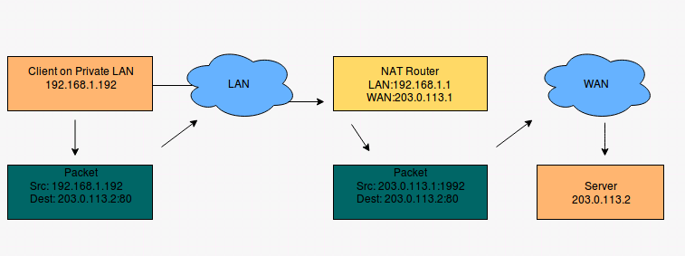
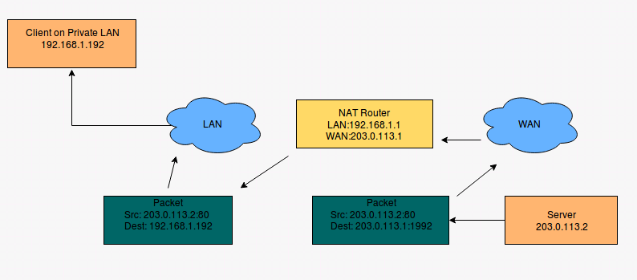

# Tìm hiểu về NAT

**I. Network address translation (NAT)**
1. Một số khái niệm:
   * Như ta đã biết IPv4 có 2 loại IP public và IP private, các máy tính trong mạng LAN sẽ được đặt IP private, những địa chỉ IP private này không tồn tại ngoài internet.
     Và ngược lại IP public thì tồn tại trên internet và cần được đăng kí với nhà cung cấp dịch vụ ISP.
     Máy tính chỉ ra ngoài internet được khi nó có địa chỉ public vì địa chỉ public là duy nhất, do vậy cần phải có một kỹ thuật để chuyển đổi các IP private trong mạng LAN thành IP public để ra ngoài internet và ngược lại để các máy Internet có thể gửi trả dữ liệu cho các máy trong LAN. NAT(Network Address Translation) ra đời để giải quyết vấn để này.
   * NAT giống như 1 Router, chuyển tiếp các gói tin giữa những lớp mạng khác nhau trên 1 mạng lớn. NAT dịch hay thay đổi 1 hoặc cả 2 địa chỉ bên trong một gói tin khi gói tin đó đi qua Router (hay 1 thiết bị có khả năng NAT).
   * Tác dụng của NAT: trong mạng internet thực tế NAT dùng để chuyển đổi địa chỉ private thành địa chỉ public để có thể đi ra được mạng internet. Nó cũng có thể để giấu đi địa chỉ thật của một hệ thống server qua đó giảm thiểu được các cuộc tấn công mạng nhằm vào các hệ thống server.
   * Source NAT (SNAT): Thay đổi trường địa chỉ nguồn/cổng nguồn của gói tin. Thường được sử dụng thay đổi địa chỉ/cổng nguồn riêng thành địa chỉ/cổng nguồn công cộng cho các gói tin đi ra ngoài internet.
   * Destination NAT (DNAT): Thay đổi trường địa chỉ đích/cổng đích của gói tin. Thường được sử dụng chuyển hướng các gói tin từ ngoài mạng đến với địa chỉ đích công khai thành địa chỉ riêng.
2. Cơ chế xử lý của NAT:
- NAT xử lý một gói tin xuất phát từ mạng bên trong đi ra ngoài (NAT outside):

Khi 1 máy tính trong mạng nội bộ có địa chỉ ip 192.168.1.192 muốn truy cập 1 webserver có địa chỉ ip 203.0.113.2. client sẽ thực hiện gửi gói tin có các trường thông tin với source ip: 192.168.1.192, destination ip: 203.0.113.2, destination port: 80 đi qua 1 thiết bị NAT (router) để ra ngoài internet và gửi gói tin đến webserver có địa chỉ là 203.0.113.2.
Trên router sẽ thực hiện thay đổi gói tin với trường source ip: 192.168.1.192 -> 203.0.113.1:1992 để đi ra ngoài internet, Lúc đó trên webserver sẽ nhận được gói tin có các trường thông tin: địa chỉ nguồn: 203.0.113.1, port nguồn: 1992, địa chỉ đích: 203.0.113.2, port đích: 80.
 
- NAT xử lý một gói tin xuất phát từ mạng bên ngoài đi vào trong (NAT inside):

NAT inside ngược lại với NAT outside. Khi gói dữ liệu đến được thiết bị thực hiện NAT, nó xem trong bảng NAT (NAT table) và thấy rằng 203.0.113.1:1992 tương ứng với 192.168.1.192, lúc đó NAT sẽ thực hiện đổi lại địa chỉ đích của gói tin và gói dữ liệu đó sẽ đến được đúng địa chỉ của máy 192.168.1.192 trong mạng LAN.

**II. Phân loại NAT**
1. NAT tĩnh - Static NAT:
   - Nat tĩnh hay còn gọi là Static NAT là phương thức NAT một đổi một. Nghĩa là một địa chỉ IP cố định trong LAN sẽ được ánh xạ ra một địa chỉ IP Public cố định trước khi gói tin đi ra Internet. Phương pháp này không nhằm tiết kiệm địa chỉ IP mà chỉ có mục đích ánh xạ một IP trong LAN ra một IP Public để ẩn IP nguồn trước khi đi ra Internet làm giảm nguy cơ bị tấn công trên mạng.
   - Phương án này có nhược điểm là nếu trong LAN có bao nhiêu IP muốn đi ra Internet thì ta phải có từng đó IP Public để ánh xạ. Do vậy phương án NAT tĩnh chỉ được đúng với các máy chủ với nhiệm vụ Public các Server này lên Internet.
2. NAT động – Dynamic NAT:
   - Nat động (Dynamic NAT) là một giải pháp tiết kiệm IP Public cho NAT tĩnh. Thay vì ánh xạ từng IP cố định trong LAN ra từng IP Public cố định. LAN động cho phép NAT cả dải IP trong LAN ra một dải IP Public cố định ra bên ngoài.
   - Ví dụ: Hệ thống LAN trong công ty có 100 IP, nếu muốn 100 IP này truy cập Internet thì theo phương án NAT tĩnh công ty sẽ phải thuê từ ISP 100 IP Public. Điều này quá tốn kém, giải pháp NAT động cho phép chỉ cần thuê từ ISP 10 IP Public nếu tại cùng một thời điểm chỉ có 10 IP trong LAN truy cập Internet. Tuy nhiên giải pháp NAT động vẫn có hạn chế vì nếu tại một thời điểm công ty cần 20 IP trong LAN truy cập Internet thì mười IP truy cập sau sẽ phải đợi đến khi nào có IP rỗi (các IP trước không chiếm dụng IP Public nữa) thì mới có thể truy cập Internet được. Chính vì thế giải pháp NAT động ít khi được sử dụng.
3. NAT Overload – PAT:
   - Nat overload – PAT là giải pháp được dùng nhiều nhất đặc biệt là trong các Modem ADSL, đây là giải pháp mang lại cả hai ưu điểm của NAT đó là: 
      * Ẩn địa chỉ IP trong hệ thống mạng nội bộ trước khi gói tin đi ra Internet giằm giảm thiểu nguy cơ tấn công trên mạng
      * Tiết kiệm không gian địa chỉ IP
   - Bản chất PAT là kết hợp IP Public và số hiệu cổng (port) trước khi đi ra Internet. Lúc này mỗi IP trong LAN khi đi ra Internet sẽ được ánh xạ ra một IP Public kết hợp với số hiệu cổng.